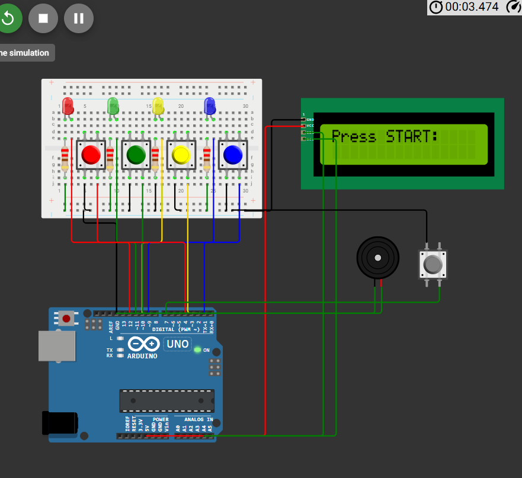
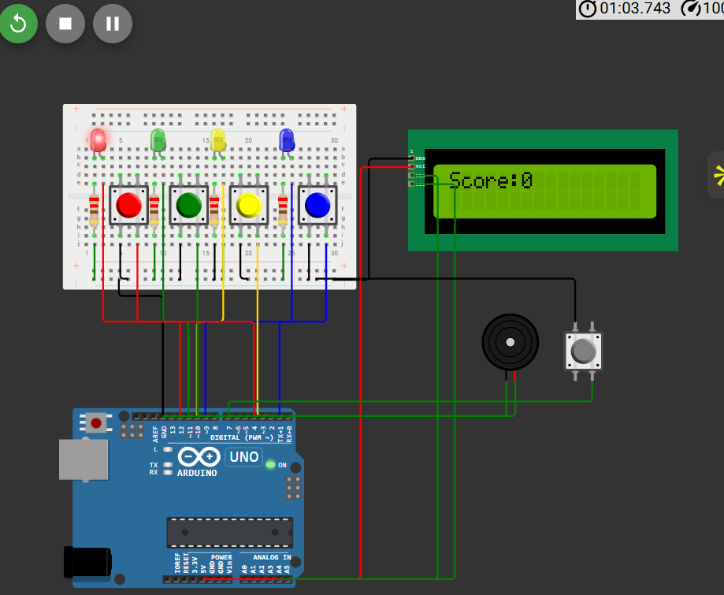
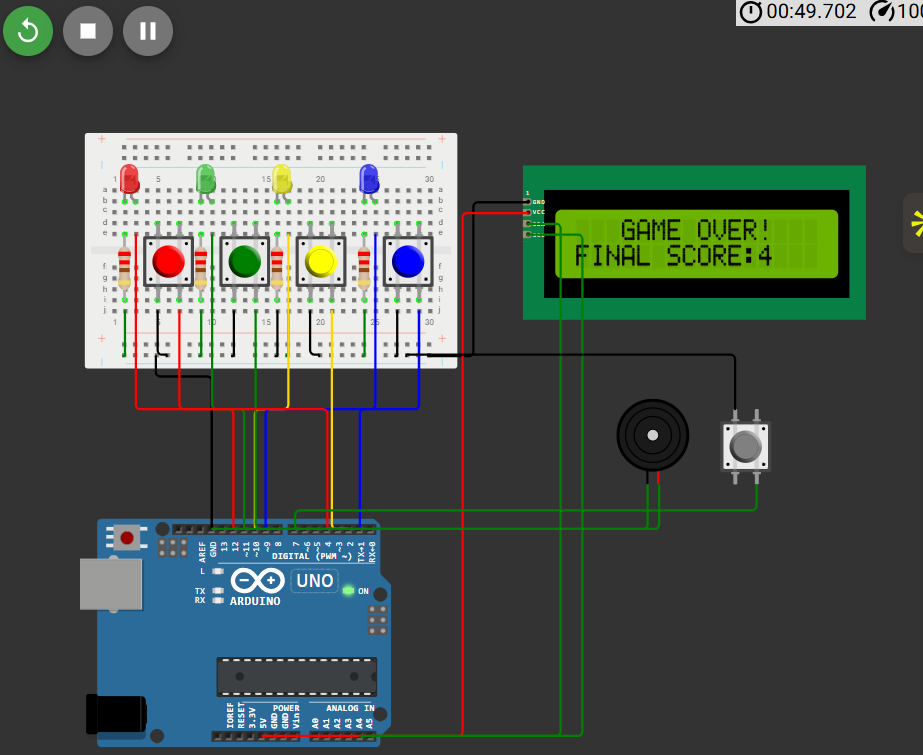

# arduino-whack-a-mole-game
An Arduino-based reaction game where LEDs light up randomly and the player must press the corresponding button quickly. The system uses an LCD to display game status and score, while a buzzer provides feedback for correct or incorrect hits. The game logic is implemented using a Finite State Machine with IDLE, RUNNING, and GAME OVER states.

# Arduino Whack-A-Mole Game

## Overview

This project implements a Whack-A-Mole style reaction game using Arduino.

The system randomly lights up one of four LEDs, and the player must press the corresponding button before the time expires. The LCD displays game status and the buzzer provides feedback for correct or incorrect inputs.

## Features

- Random LED generation
- Score tracking
- LCD game interface
- Audio feedback using buzzer
- Finite State Machine based game logic

## System States

The game uses three states:

IDLE → GAME RUNNING → GAME OVER

- IDLE: waits for user to start game
- GAME RUNNING: random LEDs appear and player reacts
- GAME OVER: score is displayed

## Circuit Diagram

## Game Screens

## Simulation

Wokwi Simulation:
https://wokwi.com/projects/452409517759309825

## Code

Arduino code available in:

code/whack_a_mole.ino

